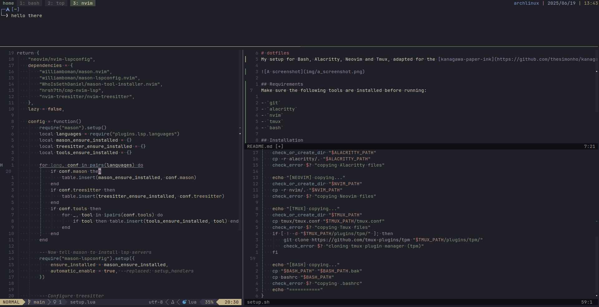

# dotfiles
My setup for Bash, Alacritty, Neovim and Tmux, adapted for the [kanagawa-paper-ink](https://github.com/thesimonho/kanagawa-paper.nvim) theme.



## Requirements
Make sure the following tools are installed before running:

- `git`
- `alacritty`
- `nvim`
- `tmux`
- `bash`
- `JetBrainsMono Nerd Font`


## Installation
You can either copy the config files manually or run the installation script.
```bash
git clone https://github.com/dduckduck/dotfiles.git
cd dotfiles
chmod +x install.sh
./install.sh
```

